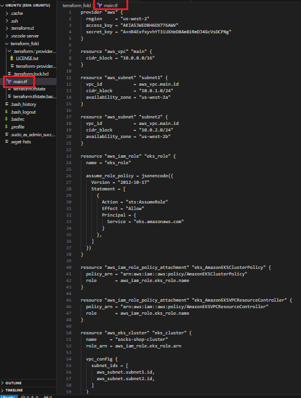
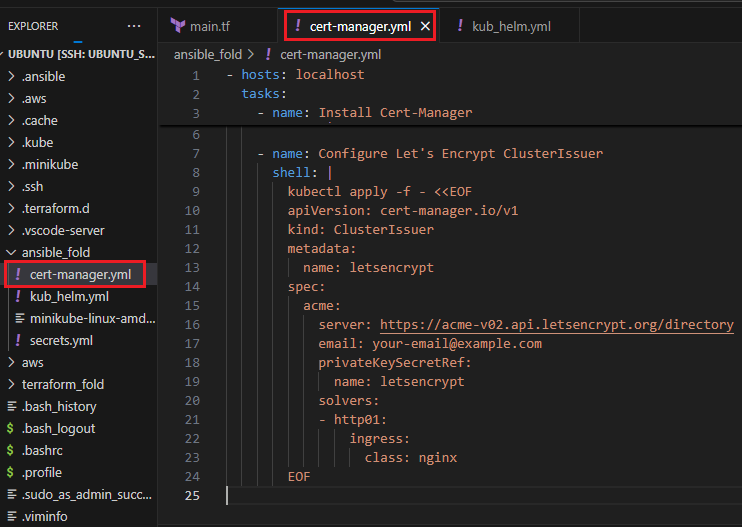
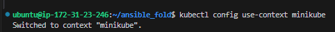
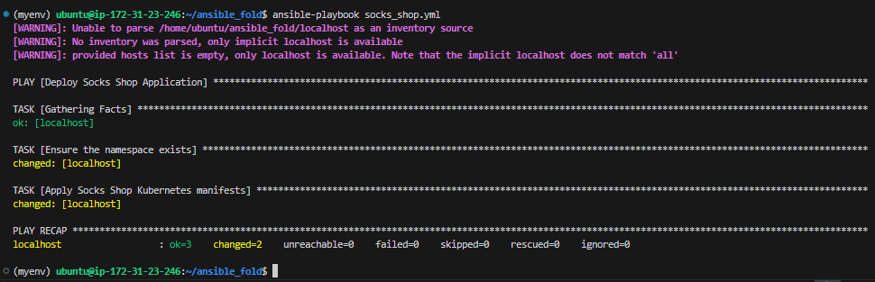
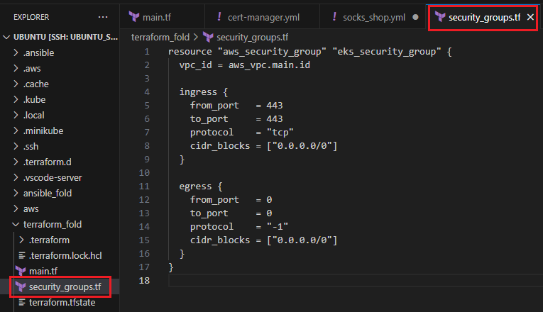

# Terraform-and-Kubernetics-Deployment-Project_3MTT

## 3MTT Cloud Engineering – Intermediate Module Assessment

## Objective
A microservices-based architecture application is deployed on Kubernetes and there’s a need to create a clear IaaC (Infrastructure as Code) deployment to be able to deploy the services in a fast manner.

## Setup Details:

Provision the Socks Shop example microservice application – https://microservices-demo.github.io/

Task Instructions:

●  Everything needs to be deployed using an Infrastructure as Code approach.

●  There is need to emphasize readability, maintainability, and DevOps 

● Recreate your setup and implemention show include the following:

- Deploy pipeline
- Metrics
- Monitoring
- Logging

●  Use Prometheus as a monitoring tool

●  Use Ansible or Terraform as the configuration management tool.

●  Use any IaaS provider.

●  The application should run on Kubernetes


## Extra Project Requirements:

●  The application should run on HTTPS with a Let’s Encrypt certificate

●  Secure the infrastructure with network perimeter security access rules

●  Use Ansible Vault for encrypting sensitive information


## Overview of the Setup

1. IaaC Tools:

   - Terraform: For provisioning infrastructure on the 
     chosen IaaS provider (e.g., AWS, GCP, Azure).

   - Ansible: For configuration management,
      application deployment, and managing Kubernetes resources.

2. Monitoring and Logging:

    - Prometheus: For monitoring metrics.
        
    - Grafana: For visualizing metrics.

    - ELK Stack (Elasticsearch, Logstash, Kibana): For logging.

3. Kubernetes:

    - Provision a Kubernetes cluster using a managed
      service (e.g., EKS, GKE, AKS).

    - Deploy the Socks Shop application on the 
      Kubernetes cluster.
        
    - Ensure the application runs on HTTPS using Let's
      Encrypt for certificates.

4. Security:
        Implement network perimeter security access rules.
        Use Ansible Vault for encrypting sensitive information.


## Detailed Steps

### Step 1: Provision Infrastructure with Terraform
### 1. Setup Terraform Configuration

- Define resources for the Kubernetes cluster.
- Define networking resources (VPC, subnets, security 
  groups).
- Define IAM roles and policies for secure access

#### Create Terraform directory


#### Configure AWS


#### Create resouces in AWS

```
provider "aws" {
  region     = "us-west-2"
  access_key = "*************6AWV"
  secret_key = "*************CPNg"
}

resource "aws_vpc" "main" {
  cidr_block = "10.0.0.0/16"
}

resource "aws_subnet" "subnet1" {
  vpc_id            = aws_vpc.main.id
  cidr_block        = "10.0.1.0/24"
  availability_zone = "us-west-2a"
}

resource "aws_subnet" "subnet2" {
  vpc_id            = aws_vpc.main.id
  cidr_block        = "10.0.2.0/24"
  availability_zone = "us-west-2b"
}

resource "aws_iam_role" "eks_role" {
  name = "eks_role"

  assume_role_policy = jsonencode({
    Version = "2012-10-17"
    Statement = [
      {
        Action = "sts:AssumeRole"
        Effect = "Allow"
        Principal = {
          Service = "eks.amazonaws.com"
        }
      },
    ]
  })
}

resource "aws_iam_role_policy_attachment" "eks_AmazonEKSClusterPolicy" {
  policy_arn = "arn:aws:iam::aws:policy/AmazonEKSClusterPolicy"
  role       = aws_iam_role.eks_role.name
}

resource "aws_iam_role_policy_attachment" "eks_AmazonEKSVPCResourceController" {
  policy_arn = "arn:aws:iam::aws:policy/AmazonEKSVPCResourceController"
  role       = aws_iam_role.eks_role.name
}

resource "aws_eks_cluster" "eks_cluster" {
  name     = "socks-shop-cluster"
  role_arn = aws_iam_role.eks_role.arn

  vpc_config {
    subnet_ids = [
      aws_subnet.subnet1.id,
      aws_subnet.subnet2.id,
    ]
  }
}
```




### 2. Create a Terraform Plan and Apply

- ### Install Terraform


- ### Initialize Terraform.


- ### Validate the configuration.


- ### Plan the changes


- ### Apply the changes


## Step 2: Configure Kubernetes with Ansible

1. Set Up Ansible Playbook:

    - Install required tools (Ansible, kubectl, Helm).
    - Deploy Prometheus and Grafana for monitoring.
    - Deploy ELK Stack for logging.
    - Deploy Socks Shop application.

#### Install Ansible


#### Install dependencies

**kub_helm file**

```
---
- name: Setup Kubernetes tools
  hosts: localhost
  become: yes
  tasks:
    - name: Install dependencies
      apt:
        name:
          - apt-transport-https
          - ca-certificates
          - curl
          - software-properties-common
        state: present

    - name: Fetch latest kubectl version
      command: curl -s https://storage.googleapis.com/kubernetes-release/release/stable.txt
      register: kubectl_version_output

    - name: Set kubectl download URL
      set_fact:
        kubectl_url: "https://storage.googleapis.com/kubernetes-release/release/{{ kubectl_version_output.stdout }}/bin/linux/amd64/kubectl"

    - name: Download and install kubectl
      get_url:
        url: "{{ kubectl_url }}"
        dest: /usr/local/bin/kubectl
        mode: '0755'

    - name: Download and install Helm
      get_url:
        url: https://get.helm.sh/helm-v3.6.3-linux-amd64.tar.gz
        dest: /tmp/helm-v3.6.3-linux-amd64.tar.gz

    - name: Extract Helm
      unarchive:
        src: /tmp/helm-v3.6.3-linux-amd64.tar.gz
        dest: /tmp
        remote_src: yes

    - name: Move Helm binary to /usr/local/bin
      command: mv /tmp/linux-amd64/helm /usr/local/bin/helm

    - name: Verify kubectl installation
      command: kubectl version --client
      register: kubectl_version_check

    - debug:
        msg: "{{ kubectl_version_check.stdout }}"

    - name: Verify Helm installation
      command: helm version
      register: helm_version_check

    - debug:
        msg: "{{ helm_version_check.stdout }}"
```

#### kub_helm.yml


#### Run playbook
`ansible-playbook kub_helm.yml`


2. Create Ansible Vault for Sensitive Information:

- Encrypt sensitive information like database passwords and API keys.


## Step 3: Configure HTTPS with Let's Encrypt

### 1. Install and Configure Cert-Manager

- Use Cert-Manager to manage Let's Encrypt certificates.

#### cert-manager.yml

```
- hosts: localhost
  tasks:
    - name: Install Cert-Manager
      shell: |
        kubectl apply -f https://github.com/jetstack/cert-manager/releases/download/v1.4.0/cert-manager.yaml

    - name: Configure Let's Encrypt ClusterIssuer
      shell: |
        kubectl apply -f - <<EOF
        apiVersion: cert-manager.io/v1
        kind: ClusterIssuer
        metadata:
          name: letsencrypt
        spec:
          acme:
            server: https://acme-v02.api.letsencrypt.org/directory
            email: your-email@example.com
            privateKeySecretRef:
              name: letsencrypt
            solvers:
            - http01:
                ingress:
                  class: nginx
        EOF
```



### Steps

**Download and Install minikube:**

`curl -LO https://storage.googleapis.com/minikube/releases/latest/minikube-linux-amd64`

`sudo install minikube-linux-amd64 /usr/local/bin/minikube`


**Install docker**

```
#!/bin/bash

sudo apt-get update
sudo apt-get install -y apt-transport-https ca-certificates curl software-properties-common
curl -fsSL https://download.docker.com/linux/ubuntu/gpg | sudo gpg --dearmor -o /usr/share/keyrings/docker-archive-keyring.gpg
echo "deb [arch=amd64 signed-by=/usr/share/keyrings/docker-archive-keyring.gpg] https://download.docker.com/linux/ubuntu $(lsb_release -cs) stable" | sudo tee /etc/apt/sources.list.d/docker.list > /dev/null
sudo apt-get update
sudo apt-get install -y docker-ce docker-ce-cli containerd.io
sudo systemctl start docker
sudo systemctl enable docker
sudo usermod -aG docker $USER
```

**Start minikube**

`minikube start --driver=docker`


**Verify minicube status**

`minicube status`


**Set kubectl context to Minikube**




**Run ansible playbook**

`ansible-playbook cert-manager.yml`


### 2. Apply Ingress Configuration for HTTPS:

- Update the Socks Shop application Ingress to use the Let's Encrypt certificate.

### ansible playbook: socks_shop.yml

```
---
- name: Deploy Socks Shop Application
  hosts: localhost
  vars:
    ansible_python_interpreter: "/home/ubuntu/ansible_fold/myenv/bin/python"
  tasks:
    - name: Ensure the namespace exists
      kubernetes.core.k8s:
        state: present
        definition:
          apiVersion: v1
          kind: Namespace
          metadata:
            name: socks-shop

    - name: Apply Socks Shop Kubernetes manifests
      kubernetes.core.k8s:
        state: present
        definition: "{{ lookup('file', 'socks_shop.yaml') }}"

```


### Create Your Kubernetes Manifest File:

Make sure you have a Kubernetes manifest file named socks_shop.yaml that contains the actual Kubernetes resource definitions.

#### Basic Structure of a Kubernetes Manifest

A Kubernetes manifest file is typically written in YAML format and defines different types of resources such as Deployments, Services, and Ingresses. For the Socks Shop application, you'll need to create and configure the following resources:

1. Deployment: Manages a set of replicas of your  
   application pods.
2. Service: Exposes the application pods to other   
   services or the external world.
3. Ingress: Manages external access to your services, 
   often with load balancing, SSL/TLS termination, etc.

#### socks_shop.yaml

```
# socks_shop.yaml

apiVersion: v1
kind: Namespace
metadata:
  name: socks-shop

---
apiVersion: apps/v1
kind: Deployment
metadata:
  name: front-end
  namespace: socks-shop
spec:
  replicas: 1
  selector:
    matchLabels:
      app: front-end
  template:
    metadata:
      labels:
        app: front-end
    spec:
      containers:
      - name: front-end
        image: weaveworksdemos/front-end:latest
        ports:
        - containerPort: 80

---
apiVersion: v1
kind: Service
metadata:
  name: front-end
  namespace: socks-shop
spec:
  selector:
    app: front-end
  ports:
  - protocol: TCP
    port: 80
    targetPort: 80

---
apiVersion: apps/v1
kind: Deployment
metadata:
  name: catalogue
  namespace: socks-shop
spec:
  replicas: 1
  selector:
    matchLabels:
      app: catalogue
  template:
    metadata:
      labels:
        app: catalogue
    spec:
      containers:
      - name: catalogue
        image: weaveworksdemos/catalogue:latest
        ports:
        - containerPort: 80

---
apiVersion: v1
kind: Service
metadata:
  name: catalogue
  namespace: socks-shop
spec:
  selector:
    app: catalogue
  ports:
  - protocol: TCP
    port: 80
    targetPort: 80

---
apiVersion: networking.k8s.io/v1
kind: Ingress
metadata:
  name: socks-shop-ingress
  namespace: socks-shop
  annotations:
    cert-manager.io/cluster-issuer: letsencrypt
spec:
  rules:
  - host: socks-shop.example.com
    http:
      paths:
      - path: /
        pathType: Prefix
        backend:
          service:
            name: front-end
            port:
              number: 80
  tls:
  - hosts:
    - socks-shop.example.com
    secretName: socks-shop-tls

```


### Explanation of the Manifest

1. Deployment
    - apiVersion: apps/v1: Specifies the API version  
      for Deployments.
    - kind: Deployment: Indicates the resource type.
    - metadata: Contains the name and labels for the  
      deployment.
    - spec: Defines the desired state of the 
      Deployment.
        - replicas: Number of pod replicas.
        - selector: Identifies the pods managed by this Deployment.
        - template: Defines the pod template used to create the pods.
          - containers: Defines the container settings, including image and port.

2. Service
    - apiVersion: v1: Specifies the API version for 
      Services.
    - kind: Service: Indicates the resource type.
    - metadata: Contains the name of the service.
    - spec: Defines the desired state of the Service.
        - selector: Specifies the labels to identify 
          which pods this Service will route traffic to.
        - ports: Defines the ports the Service will 
          expose.

3. Ingress
    - apiVersion: networking.k8s.io/v1: Specifies the 
      API version for Ingress.
    - kind: Ingress: Indicates the resource type.
    - metadata: Contains the name and annotations for  
      the Ingress.
    - spec: Defines the rules for routing external 
      traffic.
        - rules: Contains host and path definitions 
          for routing.
        - tls: Specifies TLS settings for securing the 
          connection, using the socks-shop-tls secret for the certificate.
  

### Steps to create the kubernetics manifest

#### Step 1: Create a Virtual Environment

1. Install the python3-venv package  

   `sudo apt install python3-venv`

2. Create a virtual environment:

   `python3 -m venv myenv`

3. Activate the virtual environment:

   `source myenv/bin/activate`

#### Step 2: Install the Kubernetes Python Library in the Virtual Environment

1. Install the kubernetes library using pip
   
   `pip install kubernetes`

#### Step 3: Specify the Python Interpreter in the Ansible Configuration

You can specify the Python interpreter in the ansible.cfg file:

Create or edit the ansible.cfg file in your current directory:

`nano ansible.cfg`

Add the following lines to the ansible.cfg file:
```
[defaults]
inventory = localhost

[inventory]
localhost ansible_connection=local ansible_python_interpreter=~/ansible_fold/myenv/bin/python
```

#### step 4: Run the playbook

`ansible-playbook socks_shop.yml`




## Step 4: Implement Network Security

### Define Security Groups and Network Policies:

### 1.  Use Terraform to define security groups.

  ```
  resource "aws_security_group" "eks_security_group" {
  vpc_id = aws_vpc.main.id

  ingress {
    from_port   = 443
    to_port     = 443
    protocol    = "tcp"
    cidr_blocks = ["0.0.0.0/0"]
  }

  egress {
    from_port   = 0
    to_port     = 0
    protocol    = "-1"
    cidr_blocks = ["0.0.0.0/0"]
  }
}
```


#### terraform plan


#### terraform apply 


### 2. Use Kubernetes Network Policies to restrict traffic.

  To include the NetworkPolicy and other resources for the Socks Shop application, ensure the Kubernetes manifest file is complete and structured correctly. Here's the full manifest with the specified NetworkPolicy:

**Updated kubernetics manifest with NetworkPolicy**
```
# socks_shop.yaml

apiVersion: v1
kind: Namespace
metadata:
  name: socks-shop

---
apiVersion: apps/v1
kind: Deployment
metadata:
  name: front-end
  namespace: socks-shop
spec:
  replicas: 1
  selector:
    matchLabels:
      app: front-end
  template:
    metadata:
      labels:
        app: front-end
    spec:
      containers:
      - name: front-end
        image: weaveworksdemos/front-end:latest
        ports:
        - containerPort: 80

---
apiVersion: v1
kind: Service
metadata:
  name: front-end
  namespace: socks-shop
spec:
  selector:
    app: front-end
  ports:
  - protocol: TCP
    port: 80
    targetPort: 80

---
apiVersion: apps/v1
kind: Deployment
metadata:
  name: catalogue
  namespace: socks-shop
spec:
  replicas: 1
  selector:
    matchLabels:
      app: catalogue
  template:
    metadata:
      labels:
        app: catalogue
    spec:
      containers:
      - name: catalogue
        image: weaveworksdemos/catalogue:latest
        ports:
        - containerPort: 80

---
apiVersion: v1
kind: Service
metadata:
  name: catalogue
  namespace: socks-shop
spec:
  selector:
    app: catalogue
  ports:
  - protocol: TCP
    port: 80
    targetPort: 80

---
apiVersion: networking.k8s.io/v1
kind: Ingress
metadata:
  name: socks-shop-ingress
  namespace: socks-shop
  annotations:
    cert-manager.io/cluster-issuer: letsencrypt
spec:
  rules:
  - host: socks-shop.example.com
    http:
      paths:
      - path: /
        pathType: Prefix
        backend:
          service:
            name: front-end
            port:
              number: 80
  tls:
  - hosts:
    - socks-shop.example.com
    secretName: socks-shop-tls

---
apiVersion: networking.k8s.io/v1
kind: NetworkPolicy
metadata:
  name: allow-https
  namespace: socks-shop
spec:
  podSelector:
    matchLabels:
      app: socks-shop
  policyTypes:
  - Ingress
  ingress:
  - from:
    - ipBlock:
        cidr: 0.0.0.0/0
    ports:
    - protocol: TCP
      port: 443
```


**Sock_shoo.yml playbook**

```
---
- name: Deploy Socks Shop Application
  hosts: localhost
  vars:
    ansible_python_interpreter: "/home/ubuntu/ansible_fold/myenv/bin/python"
  tasks:
    - name: Ensure the namespace exists
      kubernetes.core.k8s:
        state: present
        definition:
          apiVersion: v1
          kind: Namespace
          metadata:
            name: socks-shop

    - name: Apply Socks Shop Kubernetes manifests
      kubernetes.core.k8s:
        state: present
        definition: "{{ lookup('file', 'socks_shop.yaml') }}"
```


This setup ensures that all resources, including the NetworkPolicy, are created within the socks-shop namespace, allowing HTTPS traffic to the pods labeled with app: socks-shop.


# Summary

By following the above steps, we have been able to deploy the Socks Shop application using an Infrastructure as Code approach, ensuring readability, maintainability, and alignment with DevOps practices. The setup includes:

- Terraform for infrastructure provisioning.

- Ansible for configuration management and deployment.
    
- Prometheus and Grafana for monitoring.
    
- ELK Stack for logging.

- Cert-Manager and Let's Encrypt for HTTPS.

- Network security rules for secure access.

This approach ensures a clear, reproducible, and secure deployment of the Socks Shop application.


